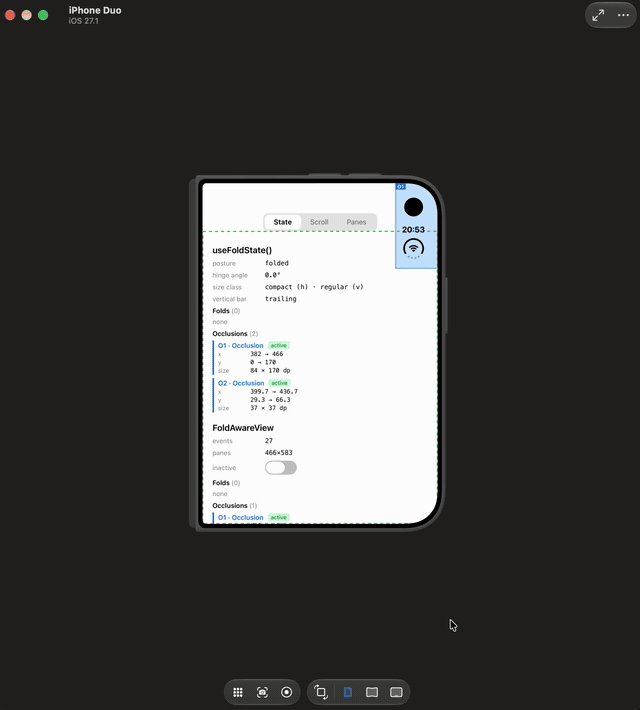
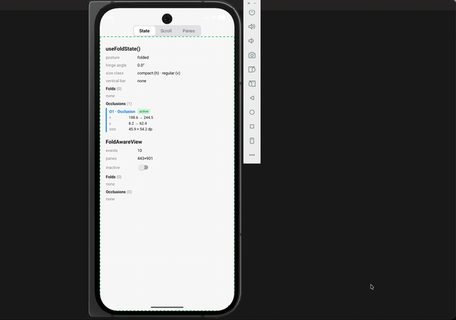
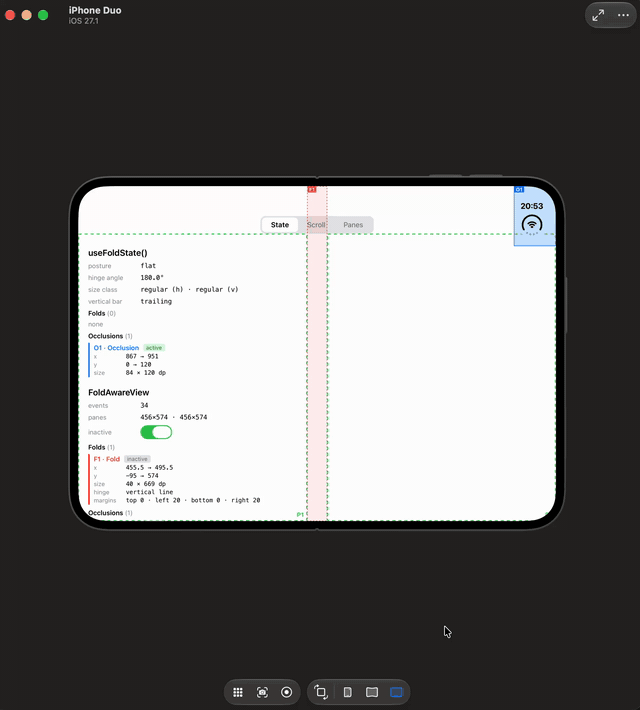
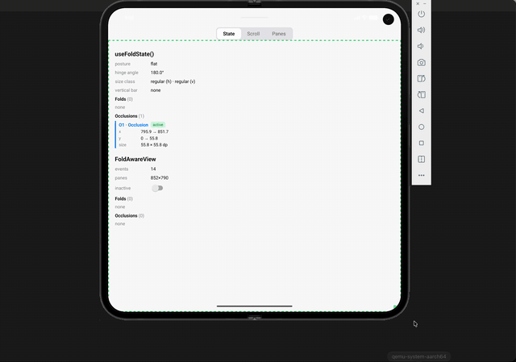
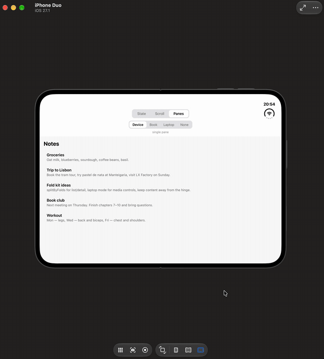
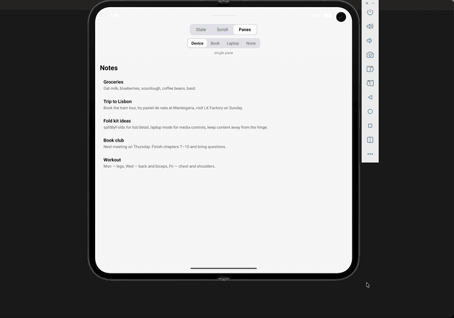

# react-native-fold-kit

Foldable device support for React Native: posture, hinge angle, fold and camera regions, and layout helpers for **iPhone Duo** and **Android foldables**.

```tsx
const posture = useFoldState((state) => state.posture); // 'flat' | 'halfOpened' | 'folded' | 'unknown'
```

## Demo

Recorded with the [example app](#example-app) on the iPhone Duo simulator (iOS 27.1) and a Pixel 9 Pro Fold emulator.

|                                                                                            |                                                                 iPhone Duo                                                                 |                                            Android (Pixel 9 Pro Fold)                                             |
| ------------------------------------------------------------------------------------------ | :----------------------------------------------------------------------------------------------------------------------------------------: | :---------------------------------------------------------------------------------------------------------------: |
| **Postures** — posture, hinge angle, folds and the camera region while folding and opening |  |                   |
| **Rotation** — regions follow the interface orientation                                    |                   |  |
| **Panes** — list/detail layout built with `splitByFolds`                                   |                                    |       |

## Features

- **Window state** with `useFoldState()`: posture, hinge angle, fold and occlusion (camera) regions, size classes and, on iOS, the vertical bar edge.
- **View-level regions** with `<FoldAwareView>`: folds and occlusions that intersect a view, in that view's coordinates.
- **Layout helper** `splitByFolds()`: splits an area into panes around folds — zero-width hinges, horizontal and vertical folds and margins included.
- **Selectors** so components re-render only for what they use: the hinge angle changes continuously while folding.
- **Jest mock** with realistic iPhone Duo presets: `react-native-fold-kit/jest`.
- **Safe defaults** everywhere else: regular phones, iOS before 27.1, older Android versions. Importing the package never throws.
- New Architecture only (TurboModules + Fabric).

## Platform support

| Platform               | Support                                                                                       |
| ---------------------- | --------------------------------------------------------------------------------------------- |
| iOS 27.1+ (iPhone Duo) | Full: `UIHingeInteraction`, reserved regions (`reservedRegions(kind:)`), vertical bar edge    |
| iOS 15.1 – 27.0        | Builds and runs; fold data stays at defaults (`posture: 'unknown'`, no regions)               |
| Android 7.0+ (API 24)  | Folds and posture via Jetpack WindowManager (`FoldingFeature`), display cutouts as occlusions |
| Android 11+ (API 30)   | Adds the hinge angle sensor (`TYPE_HINGE_ANGLE`)                                              |
| Web                    | Not supported                                                                                 |

Requires **React Native 0.82+** (the New Architecture is mandatory from 0.82 on). Developed with React Native 0.86.

Tested on the **iPhone Duo simulator** (iOS 27.1) and a **Pixel 9 Pro Fold emulator** (Android 17, API 37). It hasn't been tested on physical foldables yet — reports from real devices are very welcome in [issues](https://github.com/AlexeyTsutsoev/react-native-fold-kit/issues).

## Installation

```sh
npm install react-native-fold-kit
# or
yarn add react-native-fold-kit
```

iOS:

```sh
cd ios && pod install
```

Rebuild the app after installing.

### iOS requirements

- **Xcode 27.1 SDK** to get fold data. The package also compiles with older SDKs, but then all fold APIs are compiled out and the values stay at defaults.
- **UIScene lifecycle.** iOS 27 no longer launches apps that don't adopt `UISceneDelegate`. Apps created from the React Native template before 0.88 set up the window in `AppDelegate`; move it to a scene delegate (see [example/ios/FoldKitExample/AppDelegate.swift](example/ios/FoldKitExample/AppDelegate.swift) and the `UIApplicationSceneManifest` entry in its `Info.plist`).

## Quick start

```tsx
import { Text } from 'react-native';
import { useFoldState } from 'react-native-fold-kit';

function PostureBadge() {
  const posture = useFoldState((state) => state.posture);
  return <Text>{posture}</Text>;
}
```

A list/detail screen that follows the fold:

```tsx
import { useState } from 'react';
import { View } from 'react-native';
import {
  FoldAwareView,
  splitByFolds,
  type Fold,
  type Pane,
} from 'react-native-fold-kit';

const paneStyle = (pane: Pane) => ({
  position: 'absolute' as const,
  left: pane.x,
  top: pane.y,
  width: pane.width,
  height: pane.height,
});

function NotesScreen() {
  const [size, setSize] = useState({ width: 0, height: 0 });
  const [folds, setFolds] = useState<Fold[]>([]);
  const [first, second] = splitByFolds(size, folds);

  return (
    <FoldAwareView
      style={{ flex: 1 }}
      onLayout={(event) => setSize(event.nativeEvent.layout)}
      onRegionsChange={(regions) => setFolds(regions.folds)}
    >
      {first && second ? (
        <>
          <View style={paneStyle(first)}>
            <NoteList />
          </View>
          <View style={paneStyle(second)}>
            <NoteDetail />
          </View>
        </>
      ) : (
        <NoteList />
      )}
    </FoldAwareView>
  );
}
```

The example app has a complete version with book, laptop and single-pane layouts: [example/src/PanesScreen.tsx](example/src/PanesScreen.tsx).

## API

### `useFoldState()`

```ts
function useFoldState(): FoldState;
function useFoldState<T>(
  selector: (state: FoldState) => T,
  isEqual?: (a: T, b: T) => boolean
): T;
```

Window-level fold state. Without arguments the component re-renders on every change, including every 0.1° of hinge movement. Pass a selector to re-render only when the selected value changes:

```ts
const posture = useFoldState((state) => state.posture);
const hasFold = useFoldState((state) => state.folds.length > 0);

// A selector that builds a new object needs `isEqual`:
const layout = useFoldState(
  (state) => ({ posture: state.posture, folds: state.folds.length }),
  (a, b) => a.posture === b.posture && a.folds === b.folds
);
```

#### `FoldState`

| Field             | Type                                              | Description                                                                                                                          |
| ----------------- | ------------------------------------------------- | ------------------------------------------------------------------------------------------------------------------------------------ |
| `posture`         | `'flat' \| 'halfOpened' \| 'folded' \| 'unknown'` | Physical state of the hinge. `unknown` on devices without a hinge and on unsupported OS versions.                                    |
| `hingeAngle`      | `number \| null`                                  | Degrees, 0 — closed, 180 — flat, up to 360 on devices that fold backwards. Rounded to 0.1° on both platforms. `null` if unavailable. |
| `sizeClass`       | `{ horizontal, vertical }`                        | Each `'compact' \| 'regular' \| 'unknown'`.                                                                                          |
| `folds`           | `Fold[]`                                          | Active folds, in window coordinates.                                                                                                 |
| `occlusions`      | `Region[]`                                        | Active occlusions such as the camera, in window coordinates.                                                                         |
| `verticalBarEdge` | `'leading' \| 'trailing' \| null`                 | iOS only: the edge where the system places the vertical bar. Always `null` on Android.                                               |

All coordinates are in dp (points on iOS). Arrays are plain arrays so they can be stored as-is (`useState<Fold[]>`), but treat them as read-only: shared defaults are frozen and throw on mutation.

### `getFoldState()` and `subscribeToFoldState(listener)`

The same state outside React. `subscribeToFoldState` returns an unsubscribe function; call `getFoldState()` inside the listener to read the new value.

### `<FoldAwareView>`

A regular `View` that reports the folds and occlusions intersecting it, in its own coordinates.

| Prop              | Type                             | Description                                                                                                      |
| ----------------- | -------------------------------- | ---------------------------------------------------------------------------------------------------------------- |
| `onRegionsChange` | `(regions: ViewRegions) => void` | Called with the current regions once the handler is set (also if it is added after mount), then on every change. |
| `includeInactive` | `boolean`                        | Also report inactive regions, e.g. the fold of a flat device. Defaults to `false`.                               |
| …`ViewProps`      |                                  | Everything a `View` accepts, including children.                                                                 |

`ViewRegions` is `{ folds: Fold[]; occlusions: Region[] }`.

Use `FoldAwareView` instead of window-level regions when a component doesn't fill the window: regions arrive already in the component's coordinates, so they can be passed straight to `splitByFolds` together with the component's size.

### `splitByFolds(size, folds, options?)`

```ts
function splitByFolds(
  size: { width: number; height: number },
  folds: ReadonlyArray<Region>,
  options?: { includeInactive?: boolean; respectMargins?: boolean }
): Pane[]; // Pane = { x, y, width, height }
```

Splits an area into panes separated by folds. `size` and `folds` must share a coordinate space: a `FoldAwareView`'s size and regions, or the window size and `useFoldState()` folds.

- Vertical folds split the area into columns (left to right), horizontal folds split each column into rows (top to bottom).
- Without folds the result is one pane covering the area; an empty area has no panes.
- Zero-width hinges (Android), folds partly outside the area, folds at the very edge and overlapping folds are handled.
- `includeInactive` (default `false`): also split by inactive folds.
- `respectMargins` (default `true`): keep panes clear of the fold's margins. iOS reserves margins around the hinge for interactive content; with `false` panes may extend into them.

### `getFoldOrientation(region)`

Returns `'vertical'` or `'horizontal'` from a region's geometry (the long side of the fold band; a square counts as vertical). Folds from this package already have it in `fold.orientation`; the helper is for regions from other sources.

### `DEFAULT_FOLD_STATE`

The state reported when nothing is known: `posture: 'unknown'`, `hingeAngle: null`, no regions.

### Types

| Type                                                                                                                                  | Shape                                                                                                                                           |
| ------------------------------------------------------------------------------------------------------------------------------------- | ----------------------------------------------------------------------------------------------------------------------------------------------- |
| `Region`                                                                                                                              | `{ x, y, width, height, isActive, margins: Insets }`. `x`/`y`/`width`/`height` include the margins.                                             |
| `Fold`                                                                                                                                | `Region & { orientation: 'vertical' \| 'horizontal' }`. `vertical` — book-style (left and right), `horizontal` — laptop-style (top and bottom). |
| `Insets`                                                                                                                              | `{ top, left, bottom, right }`                                                                                                                  |
| `Pane`                                                                                                                                | `{ x, y, width, height }`                                                                                                                       |
| `Posture`, `SizeClass`, `VerticalBarEdge`, `FoldOrientation`, `FoldState`, `ViewRegions`, `FoldAwareViewProps`, `SplitByFoldsOptions` | As described above.                                                                                                                             |

## How values map on each platform

The API is the same on both platforms, but the underlying system APIs differ. The details that matter:

|                   | iOS (iPhone Duo)                                                                                                   | Android                                                                                                                                                                                                                  |
| ----------------- | ------------------------------------------------------------------------------------------------------------------ | ------------------------------------------------------------------------------------------------------------------------------------------------------------------------------------------------------------------------ |
| `posture`         | From `UIHinge.status`: closed → `folded`, partially open → `halfOpened`, fully open → `flat`                       | From `FoldingFeature.state` while the window crosses the fold. Otherwise from the hinge angle: < 30° `folded`, 30–150° `halfOpened`, ≥ 150° `flat` (e.g. split screen, folded device). `unknown` without a hinge sensor. |
| `hingeAngle`      | `UIHinge.angle`                                                                                                    | `TYPE_HINGE_ANGLE` sensor, API 30+                                                                                                                                                                                       |
| Fold `isActive`   | `UIViewReservedRegion.isActive`                                                                                    | `FoldingFeature.isSeparating`: separates content when half-opened or when the hinge has a physical gap                                                                                                                   |
| Fold geometry     | A zero-thickness line with margins around it: on the iPhone Duo simulator a 40 dp band = 20 dp margin on each side | A band or a zero-width line, no margins                                                                                                                                                                                  |
| `occlusions`      | Reserved occlusion regions (camera housing)                                                                        | Display cutouts                                                                                                                                                                                                          |
| `sizeClass`       | Trait collection size classes                                                                                      | Width < 600 dp or height < 480 dp is `compact`, otherwise `regular`                                                                                                                                                      |
| `verticalBarEdge` | `UITraitCollection.verticalBarEdge`                                                                                | Always `null`                                                                                                                                                                                                            |

Behaviour worth knowing:

- **Flat devices have no active fold.** A fully opened device reports its fold as inactive, so `folds` is empty and `splitByFolds` returns one pane. Use `includeInactive` to get it anyway.
- **FoldAwareView in scroll views.** On Android the view recalculates its regions while its scroll container moves. On iOS it recalculates on its own layout, window, trait and hinge changes; UIKit has no notification for an ancestor scrolling, so a `FoldAwareView` inside a scroll view is not updated during scrolling.
- **Regions settle after rotation on iOS.** UIKit updates reserved regions during the rotation animation without notifying anyone. The library keeps re-reading regions for a short time after each change (until they are stable for 0.5 s, at most 3 s) and reports the final values.
- **Background.** On Android the hinge sensor is stopped while the app is in the background, and no events are sent until it returns to the foreground. The last state stays available.

## Testing with Jest

The package ships a mock with the same API that never touches native code:

```ts
// jest.setup.ts
jest.mock('react-native-fold-kit', () => require('react-native-fold-kit/jest'));
```

```tsx
import {
  applyMockFoldState,
  mockFoldStates,
  resetMockFoldState,
  setMockFoldState,
} from 'react-native-fold-kit/jest';

afterEach(() => resetMockFoldState());

it('shows two panes on a half-opened device', async () => {
  applyMockFoldState(mockFoldStates.halfOpenedBook);
  await render(<NotesScreen />);
  // …
});

it('tweaks a single field', () => {
  setMockFoldState({ posture: 'halfOpened', hingeAngle: 95 });
});
```

| Helper                        | Description                                                                                                                                                         |
| ----------------------------- | ------------------------------------------------------------------------------------------------------------------------------------------------------------------- |
| `mockFoldStates`              | Presets with iPhone Duo geometry measured on the iOS 27.1 simulator: `flat`, `halfOpenedBook`, `halfOpenedLaptop`, `folded`. Folds include the Duo's 20 dp margins. |
| `applyMockFoldState(state)`   | Sets the window-level state and makes every `FoldAwareView` report the same folds and occlusions, as if it filled the window.                                       |
| `setMockFoldState(patch)`     | Shallow-merges a patch into the window-level state.                                                                                                                 |
| `setMockViewRegions(regions)` | Sets the regions every mounted `FoldAwareView` reports.                                                                                                             |
| `resetMockFoldState()`        | Restores defaults; call it in `afterEach`.                                                                                                                          |

`splitByFolds` and `getFoldOrientation` in the mock are the real implementations.

## Example app

The [example app](example/) has three tabs:

- **State** — everything `useFoldState()` and a full-screen `FoldAwareView` report, with regions drawn over the screen and panes from `splitByFolds`.
- **Scroll** — `FoldAwareView` cards in horizontal and vertical scroll views, to see regions follow scrolling.
- **Panes** — the list/detail layout from the quick start with book, laptop and single-pane modes, and simulated folds for devices without one.

See [CONTRIBUTING.md](CONTRIBUTING.md) for how to run it on the iPhone Duo simulator and a foldable Android emulator.

## Troubleshooting

- **`native module 'FoldKit' is not available` warning.** The native part isn't linked: rebuild the app after installing (and run `pod install` on iOS). In Jest, use the mock.
- **The app doesn't launch on iOS 27.** Adopt the UIScene lifecycle, see [iOS requirements](#ios-requirements).
- **`posture` is always `unknown` on iOS.** The app was built with an SDK older than 27.1, or runs on iOS before 27.1.
- **`folds` is empty on an opened device.** Expected: a flat device's fold is inactive. Pass `includeInactive`.

## Contributing

- [Development workflow](CONTRIBUTING.md#development-workflow)
- [Sending a pull request](CONTRIBUTING.md#sending-a-pull-request)
- [Code of conduct](CODE_OF_CONDUCT.md)

## License

MIT

---

Made with [create-react-native-library](https://github.com/callstack/react-native-builder-bob)
